📹 Demo video: https://us06web.zoom.us/clips/share/b2ucu4zJRCGT2EU9DtriNA

# Casa Agent – Walkthrough Screenshots

This page shows the workflow of the **Casa Agent multi-agent system**, which evaluates property listings against a user preference profile.

---

## 1. Project Structure

Overview of the repository structure.

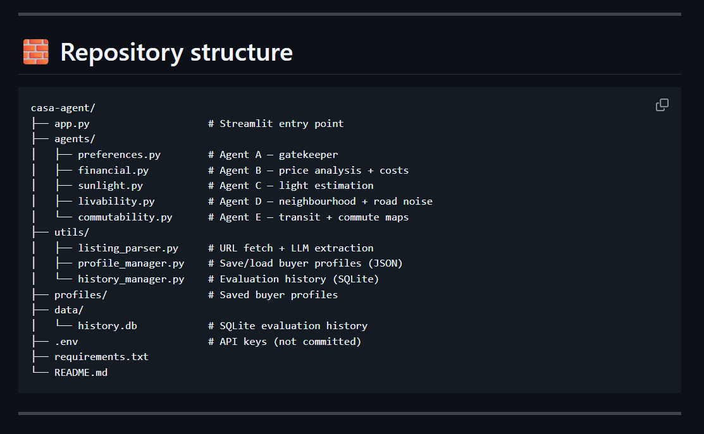

---

## 2. Agent Instructions

Example of the instructions given to the agents that evaluate listings.

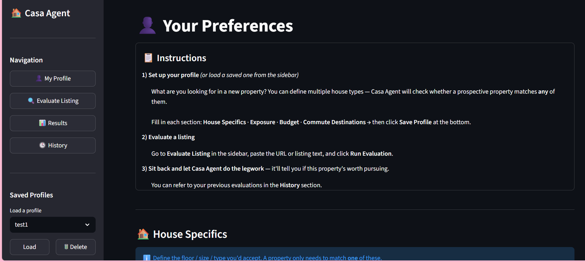

---

## 3. User Preference Profile – House Details

User defines preferences about the type of property they are looking for.

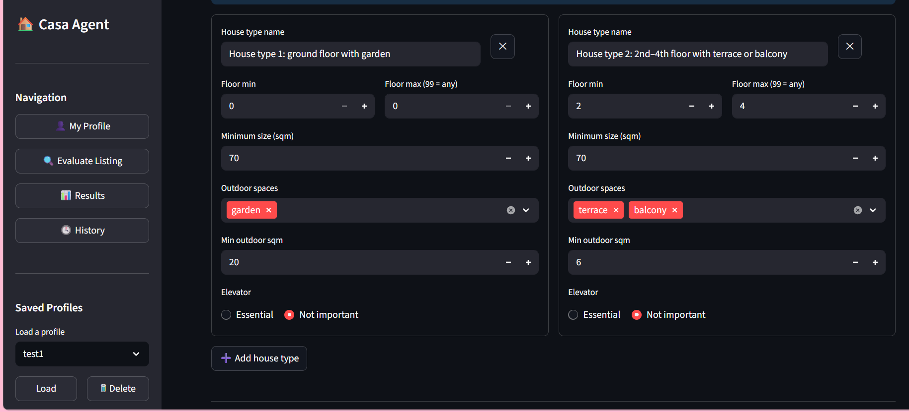

---

## 4. User Preference Profile – Exposure

Preferred sunlight exposure and orientation.

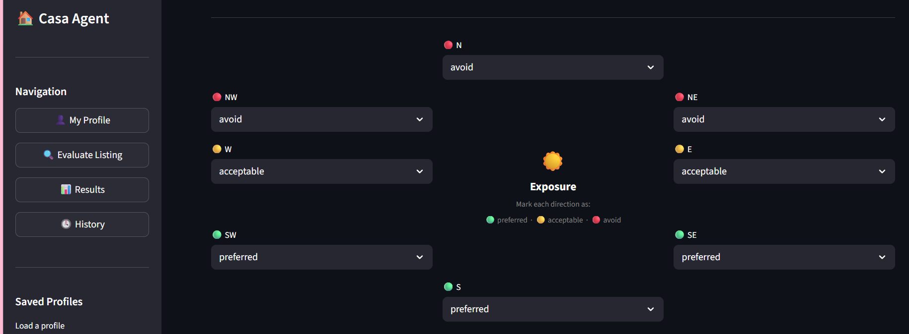

---

## 5. User Preference Profile – Commute

User specifies important commute destinations.

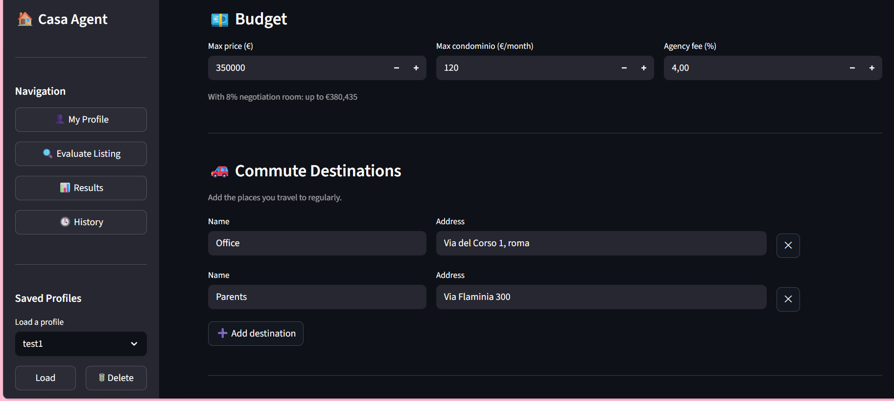

---

## 6. Save User Profile

Saving the preference profile used by the evaluation agents.

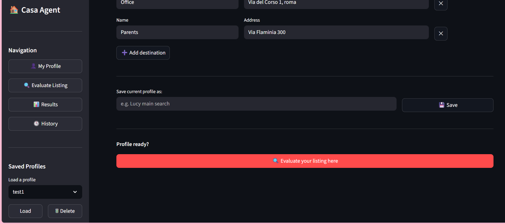

---

## 7. Evaluate Listing

A property listing is submitted for analysis by the agent system.

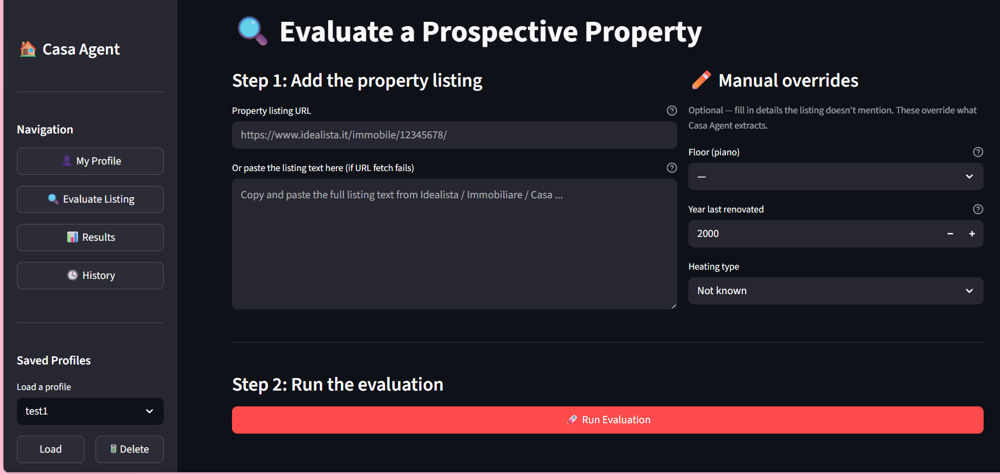

---

## 8. Example Result – Apartment 1 (Recommended)

The system evaluates the listing and determines it is worth visiting.

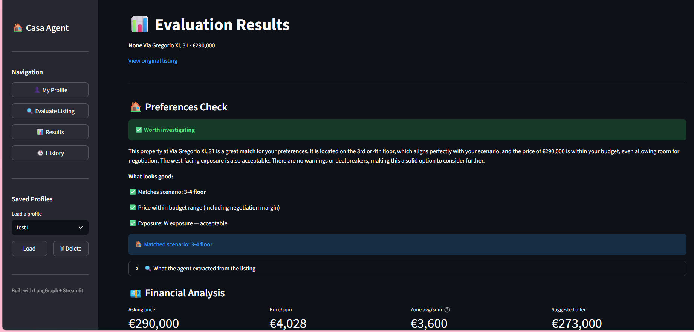

---

## 9. Financial Evaluation

The financial agent evaluates affordability and price metrics.

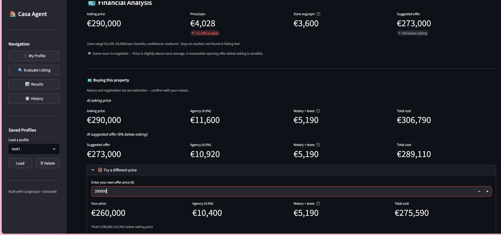

---

## 10. Sunlight / Exposure Evaluation

The exposure agent evaluates sunlight and orientation.

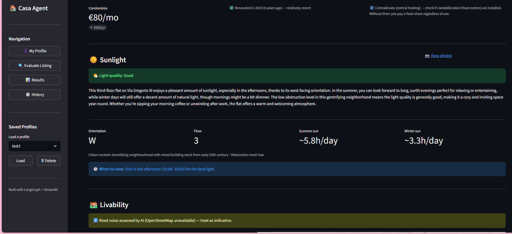

---

## 11. Commute Evaluation

The commute agent evaluates travel time to important destinations.

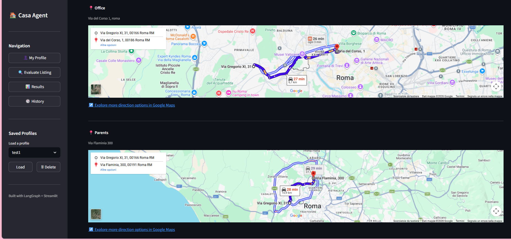

---

## 12. Example Result – Apartment 2 (Not Recommended)

The system determines the listing does not meet the user's criteria.

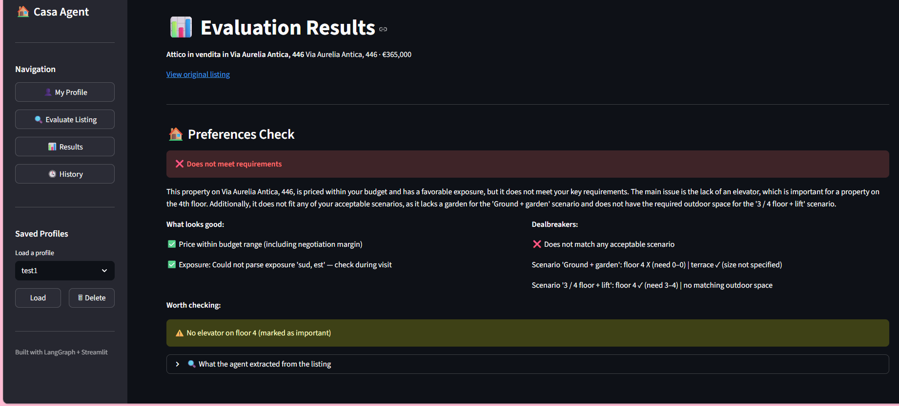

---

## 13. Evaluation History

The system keeps a history of previous evaluations.

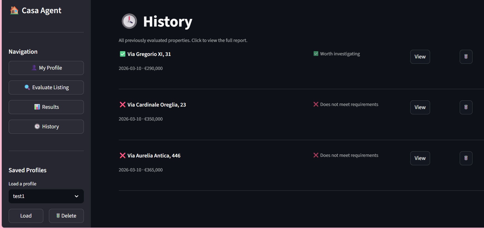
